<h1>Rapport de TP N°3-4 : Projet Spring Boot avec Spring Security</h1>
<h2>Development Web JEE Spring MVC</h2>
<h2>Introduction</h2>

Ce projet pratique explore le développement d'une application web sécurisée 
axée sur la gestion complète des patients en utilisant les frameworks Spring Boot 
et Spring Security. Le code fourni établit une base solide,
mettant en avant des fonctionnalités cruciales telles que la création,
la lecture, la mise à jour et la suppression (CRUD) des données des patients.
 
L'objectif initial consiste à configurer une application Spring Boot,
mettant en avant les fonctionnalités flexibles et puissantes du framework.
La sécurité est une préoccupation majeure, avec l'implémentation 
de trois stratégies d'authentification différentes : 
<ul>
<li>InMemoryAuthentication</li>
<li>JdbcAuthentication</li>
<li>l'utilisation d'un service UserDetailsService.</li>
</ul>
L'intégration d'une entité JPA pour la représentation des données 
des patients souligne le concept de persistance des données. 
Le code inclut des opérations complètes de CRUD, 
illustrant comment interagir efficacement avec la base de données pour gérer
les informations des patients.

Un aspect notoire de ce projet est la prise en charge de deux bases
de données distinctes, H2 et MySQL, mettant en lumière la flexibilité de
Spring Boot en termes de connectivité à diverses sources de données.

<h2>Ennoncé</h2>

Créer une application Web JEE basée sur Spring MVC, Thylemeaf et Spring Data JPA qui permet de gérer les patients. L'application doit permettre les fonctionnalités suivantes :

<ul>
<li>stocker dans H2 DataBase puis dans MySQL</li>
<li>Afficher les patients</li>
<li>Faire la pagination</li>
<li>Chercher les patients</li>
<li>Ajouter un patient</li>
<li>Modifier un patient</li>
<li>Supprimer un patient</li>
<li>Sécuriser les données des utilisateurs</li>
<li>Gérer les droits d'accès</li>
</ul>
<h2>Objectifs</h2>
<ol>
<li>Créer un projet spring boot avec les dépendances Web, Spring Data JPA, H2,
Lombok, Thymeleaf et MySQL</li>
<ul>
<li>Créer l'entité JPA Patient</li>
<li>Créer l'interface PatientRepository basée sur Spring Data</li>
<li>Configurer l'application pour se connecter soit à h2 Database ou à MySQL (application properties)</li>
<li>Créer le contrôleur Spring MVC</li>
<li>Créer les vues basées sur Thymeleaf </li>
</ul>
<li>Sécuriser cette application en intégrant un système d'authentification basé sur Spring security avec les trois stratégies: 
<ul>
<li>InMemoryAuthentication</li>
<li>JdbcAuthentication</li>
<li>UserDetailsService</li>
</ul>
</ol>
<h2>Conception</h2>

<h2>Réalisation</h2>
<ol>
<li>Création du projet spring boot avec les dépendances Web, Spring Data JPA, H2,
Lombok, Thymeleaf qui sert à:</li>
<ul>
<li>Affichage des données des patients dans H2 DataBase et dans MySQL</li>
<h3>SQL</h3>
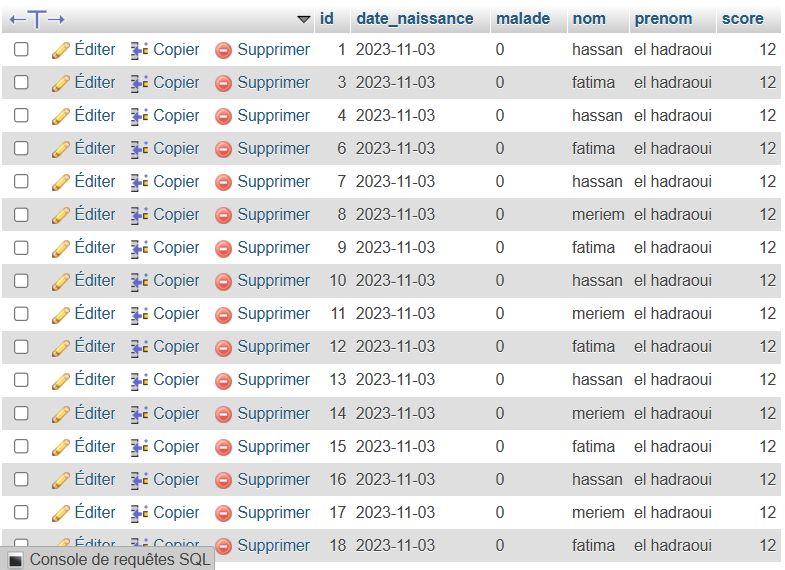
<h3>H2</h3>
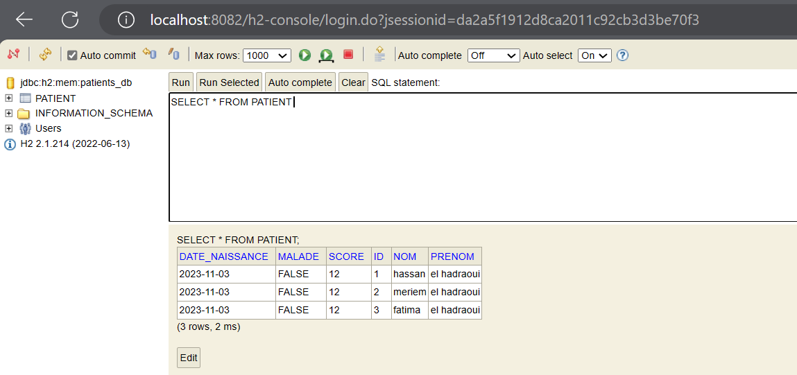
<li>Afficher les patients</li>

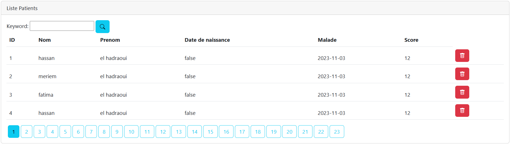
<li>Faire la pagination</li>
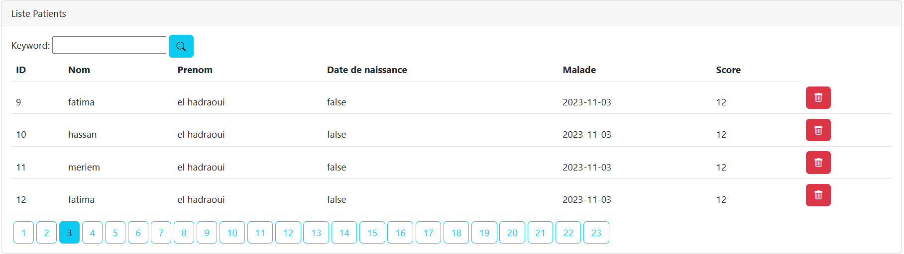
<li>Chercher un patient</li>

<li>Ajouter un patient</li>

<li>Modifier un patient</li>

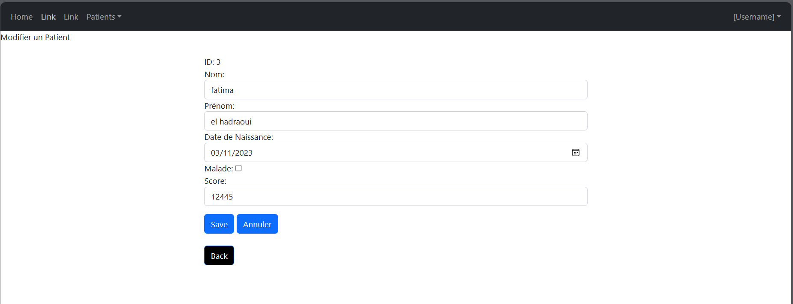

<li>Supprimer un patient</li>
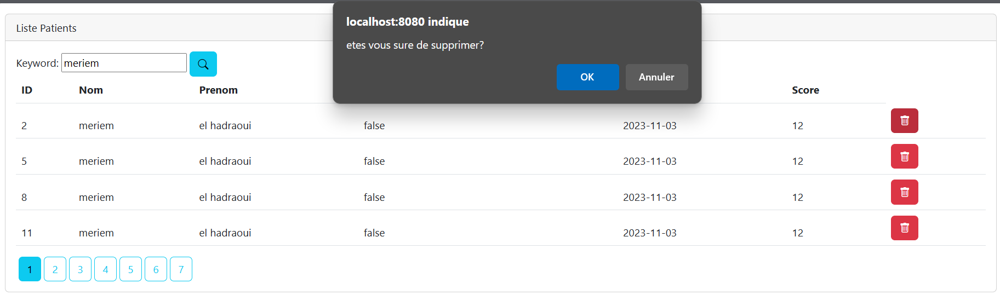
voila on a supprimé le patient ou l'id égale 5 et 2
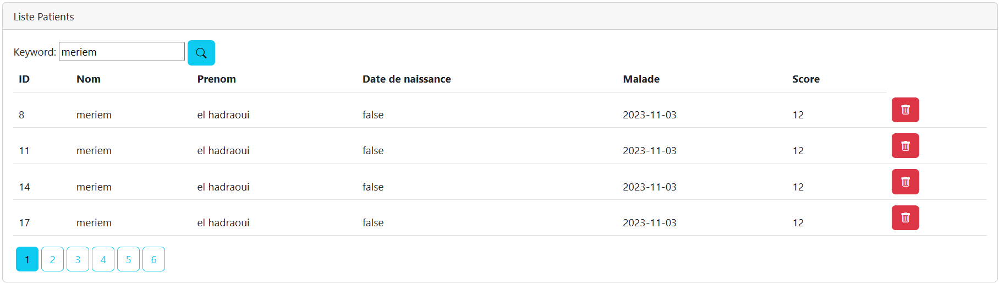

<li>Validation des données </li>
<ol>
    <li>Ajout de l'annotation de validation Spring : <code>@Valid</code></li>
    <li>Ajout des annotations de validation appropriées sur les champs concernés.</li>
    <li>Au niveau du contrôleur, utilisation de <code>@Valid</code> et de l'objet <code>BindingResult</code> pour gérer les résultats de la validation.</li>
    <li>Enfin, au niveau du code HTML, utilisation de l'expression Thymeleaf <code>th:errors</code> pour afficher les messages d'erreur en cas de validation échouée.</li>
</ol>
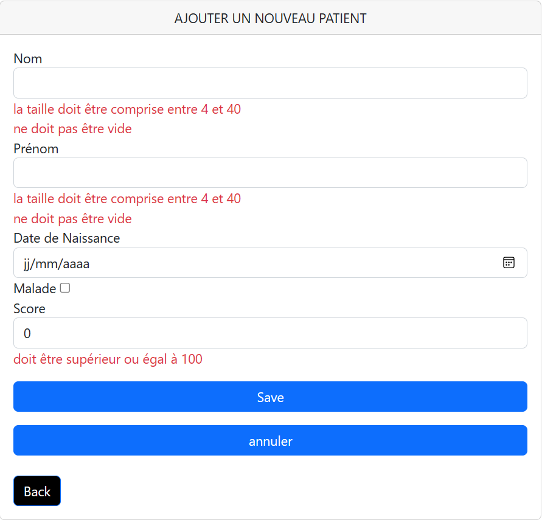
</ul>
<li>Sécuriser cette application en intégrant un système d'authentification basé sur 
Spring security .
<h3> Installation de Spring Security</h3>
Lors de l'installation de Spring Security, celui-ci génère automatiquement cette page d'authentification.
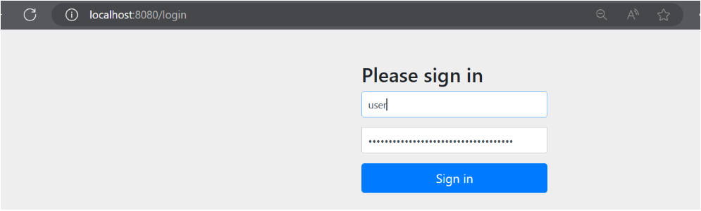
Un mot de passe est généré et constitue le seul moyen d'accéder à cette page.
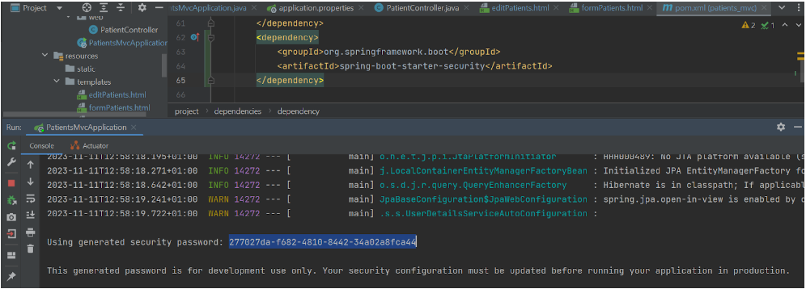
Pour personnaliser la configuration de spring security:on creer la classe <code>SecurityConfig</code> dans le package security.
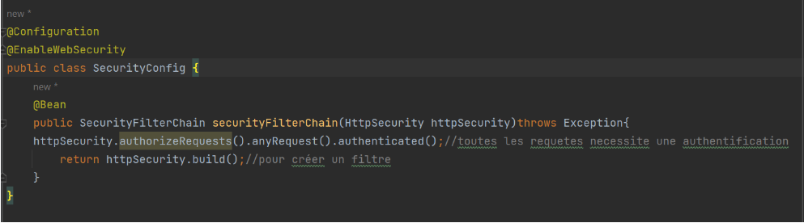

<ul>
<li>InMemoryAuthentication</li>

 <strong>InMemoryAuthentication </strong>est une méthode d'authentification de Spring Security qui permet de stocker les informations d'identification directement en mémoire, particulièrement adaptée aux scénarios de développement légers ou lorsque la gestion des utilisateurs est minimale. Dans cette approche, les informations d'identification, telles que les noms d'utilisateur, mots de passe et rôles, sont configurées statiquement dans la mémoire de l'application. Cette méthode offre une gestion rapide et simple des utilisateurs au niveau de la configuration de l'application, sans nécessiter de stockage persistant, et est souvent utilisée pour des tests et des développements rapides.

<li>JdbcAuthentication</li>

<strong>JdbcAuthentication</strong> est une méthode qui repose sur une source de données JDBC (Java Database Connectivity) pour stocker et récupérer les informations d'identification des utilisateurs. Les informations, telles que les noms d'utilisateur, mots de passe et rôles, sont stockées dans une base de données relationnelle telle que MySQL, PostgreSQL, ou H2. L'authentification se fait en interrogeant cette base de données pour vérifier les informations d'identification fournies lors de la connexion. Cette approche offre une gestion centralisée des utilisateurs, facilitant les mises à jour sans nécessiter de modifications directes dans le code de l'application.

<li>UserDetailsService</li>

<strong>UserDetailsService </strong>quant à elle, est une interface de Spring Security permettant de charger les informations d'identification des utilisateurs à partir d'une source externe personnalisée. Les classes implémentant cette interface définissent leur propre logique pour charger les informations d'identification à partir de sources diverses, telles que des bases de données, des services web, ou d'autres systèmes d'authentification personnalisés. Cette méthode offre une flexibilité considérable, adaptée aux situations où la gestion des utilisateurs est complexe ou nécessite des intégrations spécifiques avec des systèmes existants. Les informations d'identification peuvent être stockées dans différentes sources, avec la logique de chargement définie selon les besoins spécifiques de l'application.

<li>Gérer les droits d'accès</li>

Pour afficher la liste des patients, nous avons utilisé Thymeleaf, un moteur
de template, pour rendre dynamique l'affichage des données des patients. De plus,
WebJars a été utilisé pour intégrer des styles modernes provenant de bibliothèques 
externes, créant ainsi une présentation efficace et agréable des informations sur les 
patients. Cette approche assure une expérience visuelle cohérente et attrayante pour 
les utilisateurs. De plus, les droits d'accès ont été configurés pour permettre à tous 
les utilisateurs d'afficher les données, avec des restrictions fonctionnelles spécifiques 
pour les utilisateurs ordinaires, tandis que les utilisateurs ayant des droits d'administration
bénéficient d'un accès étendu et de fonctionnalités supplémentaires.

<h3>Pages Accessibles par l'Administrateur</h3>

Les administrateurs ont des privilèges étendus et peuvent accéder à des fonctionnalités avancées pour la gestion des patients. Ils ont la possibilité de visualiser, ajouter, modifier et supprimer des données, 

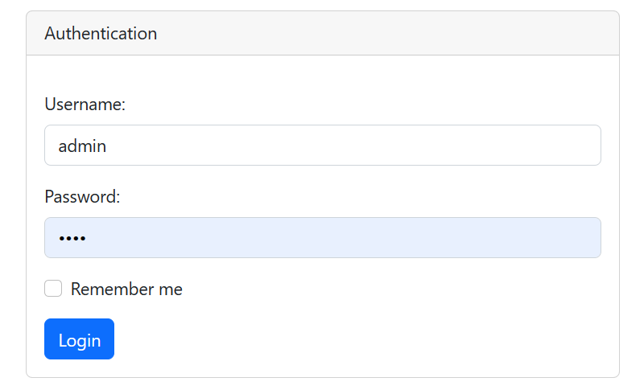

<ol>
<li>Visualiser la liste des patient</li>
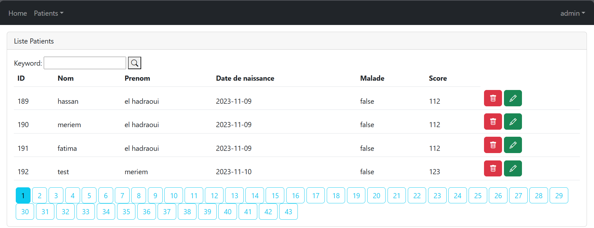

<li>Chercher un patient</li>
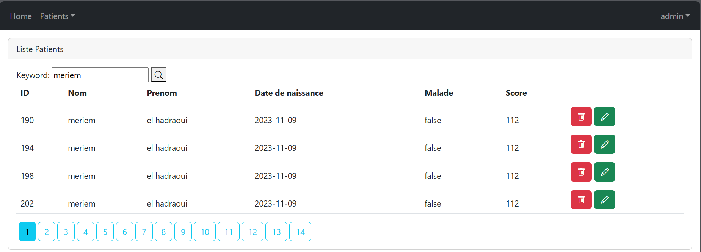

<li>Ajouter un patient</li>
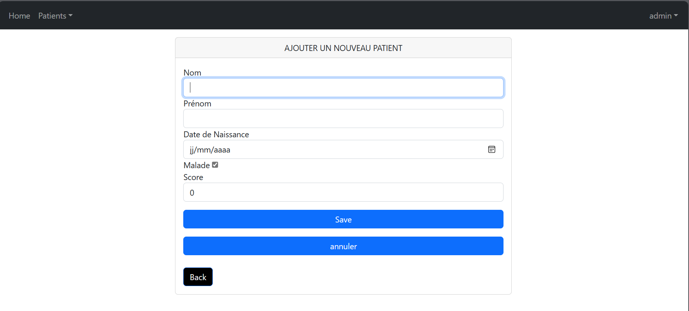

<li>Modifier un patient</li>
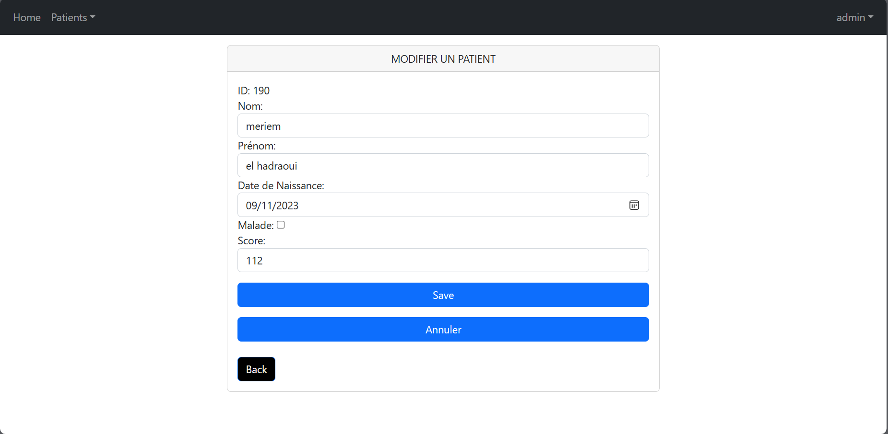

<li>Supprimer un patient</li>
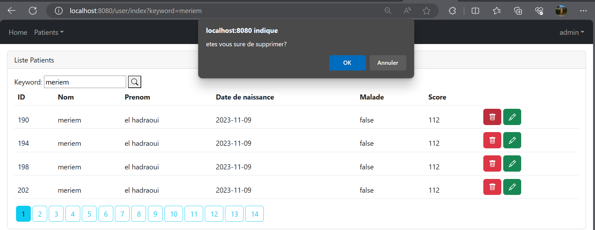

</ol>

<h3>Pages Accessibles par un Utilisateur Normal</h3>

Les utilisateurs normaux ont un accès restreint, focalisé sur la consultation des données. Ils peuvent parcourir la liste des patients et effectuer des recherches.

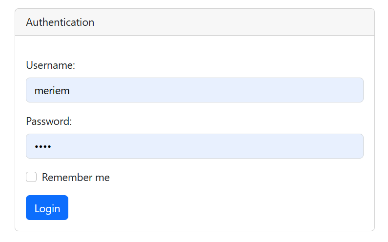

<ol>
<li>Visualiser la liste des patient</li>
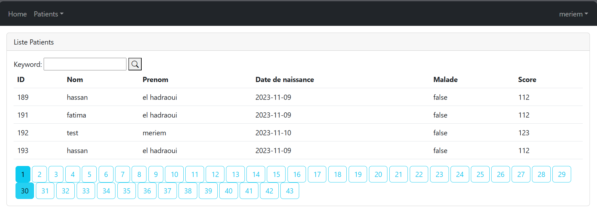
<li>Chercher un patient</li>
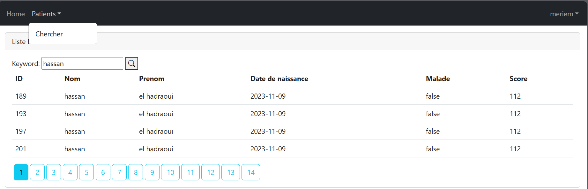
<li>Supprimer un patient</li>
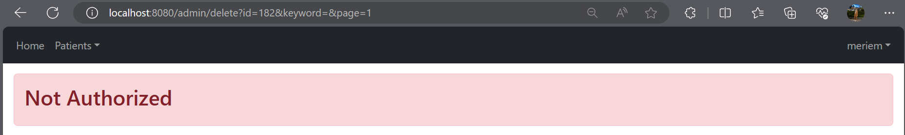
</ol>
</ul>
</ol>
<h2>Conclusion</h2>

Le rapport présente un projet de développement web JEE avec Spring MVC,
axé sur la gestion complète des patients en utilisant les frameworks Spring
Boot et Spring Security. Le projet inclut des fonctionnalités CRUD, une
sécurité robuste avec trois stratégies d'authentification différentes, et
la prise en charge de deux bases de données, H2 et MySQL. Le rapport détaille 
la conception, la réalisation, et les différentes fonctionnalités mises en œuvre, 
notamment l'affichage, la pagination, la recherche, l'ajout, la modification et la 
suppression des patients. La gestion des droits d'accès différenciés entre administrateurs
et utilisateurs normaux.

